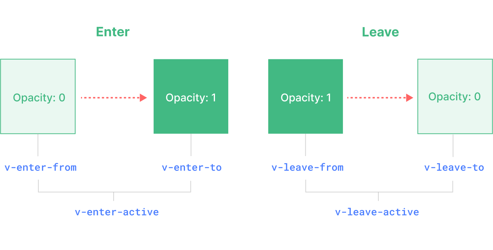

# Vue animation & transition: built-in component

## les classes de transition

Les classes qui sont ajouté puis retirer tout au long de la transition


A noter:
Pas de besoin de définir de valeur pour v-enter-to et v-leave-from si les valeurs par défaut d'un élément correspond à notre animation

ex: pour opacity pas besoin de le définr à 1 car c'est déja sa valeur par defaut

## Les éléments que l'on peut animer

Les v-if, v-show...

Les éléments avec une `key` => il faudra ajouter du css à l'élément notamment une position relative du wrapper et une position absolute de l'élément qui a `key`, pour éviter le decalage dans le DOM

Les component dynamique `<component :is="name"></component>` => il faudra alors ajouter l'attribut `mode="out-in"` au component transition pour que celui-ci n'est pas de decalage dans le DOM

## Pour les éléments nested

il faudra ajouter l'attribut `duration` a Transition (durée total des animations) pour notamment avoir la transition du `leave`

**Le component a besoin de savoir combien de temps dure l'animation avant de faire disparaitre l'element du DOM**

## appear

Attribut permettant de lancer l'animation dés le mount du component

## Re-usable transition

Plutot que de définir le css d'une transition de maniere globale, la recommandation est de créer un component spécifique à la transiton de lui passer un slot

Le slot va alors contenir la logique et les valeurs dynamiques

```vue FadeTransition component
<template>
  <Transition name="fade">
    <slot></slot>
  </Transition>
</template>

<style>
.fade-enter-active,
.fade-leave-active {
  transition: opacity 0.5s ease;
}

.fade-enter-from,
.fade-leave-to {
  opacity: 0;
}
</style>
```

Puis dans le component où l'on souhaite l'utiliser

```vue
<template>
  <FadeTransition>
    <span v-show="greating">hello</span>
  </FadeTransition>
</template>
```

## Hook & props d'animation

### Using with CSS framework

Exemple avec Tailwind, si on ne veut pas définir les d'animtaiton dans le style en CSS mais en utilisant les class

```vue
<template>
  <Transition
    enter-active-class="transition-opacity duration-500"
    leave-active-class="transition-opacity duration-500"
    enter-from-class="opacity-0"
    leave-to-class="opacity-0"
  >
</template>
```

Equivalent à écrire

```vue
<style>
.v-enter-active,
.v-leave-active {
  transition: opacity 0.5s ease;
}

.v-enter-from,
.v-leave-to {
  opacity: 0;
}
</style>
```

### Animation avec JS

On va utiliser les hooks pour lancer le Js suivant les différents phase de l'animation

```vue
<template>
  <Transition
    @before-enter="onBeforeEnter"
    @enter="onEnter"
    @leave="onLeave"
    :css="false">
    <slot></slot>
  </Transition>
</template>
```

### Using @keyframes

Avec une animation css, on va jouer seulement sur enter-active & leave-active pour animer la keyframes

```vue
<template>
  <Transition name="rubberband">
    <slot></slot>
  </Transition>
</template>

<style>
@keyframes rubberband {
  from {
    opacity: 1;
  }
  to {
    opacity: 0;
  }
}
.rubberband-enter-active {
  animation: rubberband 1s;
}
.rubberband-leave-active {
  animation: rubberband 1s reverse;
}
</style>
```

## Transition group

```vue
<template>
  <TransitionGroup tag="ul">
    <li
      v-for="(creature, index) in pokemon"
      :key="creature.name">
      {{ creature.name }}
      <button @click="pokemon.splice(index, 1)">X</button>
    </li>
  </TransitionGroup>
  <button @click="shuffleArray(pokemon)">Shuffle</button>
</template>

<style>
.v-move, // pour animer tous les éléments de la liste lorqu'il bouge. Fonctionne à l'ajout, suppression et mélange de la liste
.v-enter-active,
.v-leave-active {
  transition: all 0.5s ease;
}
.v-enter-from,
.v-leave-to {
  opacity: 0;
  transform: translateX(30px);
}
.v-leave-active {
  position: absolute; // chaque element a sa position abolute
}
</style>
```

### En utilisant un filtre de recherche staggering


